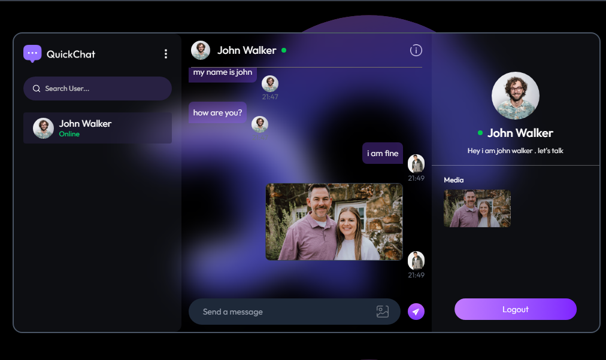

## MERN Chat Application

## 📌 Project Description

This is a real-time chat application developed using the MERN stack (MongoDB, Express.js, React, Node.js) along with Socket.io for instant, bidirectional communication. The app allows users to register, log in, and engage in one-on-one messaging with other users in real time. It also supports features like typing indicators and online/offline presence updates, delivering a smooth and interactive user experience.

✨ Key Features

💬 Chat Features:

🔐 User registration and login

👤 Real-time one-on-one messaging

✍️ Typing indicators

🟢 Online/offline status updates

🕓 Chat history and recent messages

📬 Instant delivery of messages using Socket.io

🧾 Scrollable chat UI with timestamped messages

🛠️ Backend Features:

📁 Manage users and their sessions

📦 Store messages in MongoDB

🔧 Secure API routes using JWT authentication

🔄 Real-time event handling with Socket.io

🔧 Tech Stack:

Frontend: React, Context Api, Axios

Backend: Node.js, Express.js, MongoDB

Realtime Communication: Socket.io

Authentication: JWT and bcrypt

Database: MongoDB with Mongoose

Deployment (optional): Render for backend, Vercel

## 🔗 Live Demo

👉 [Click here to view the project](https://mern-chat-app-brown-alpha.vercel.app/)

---

